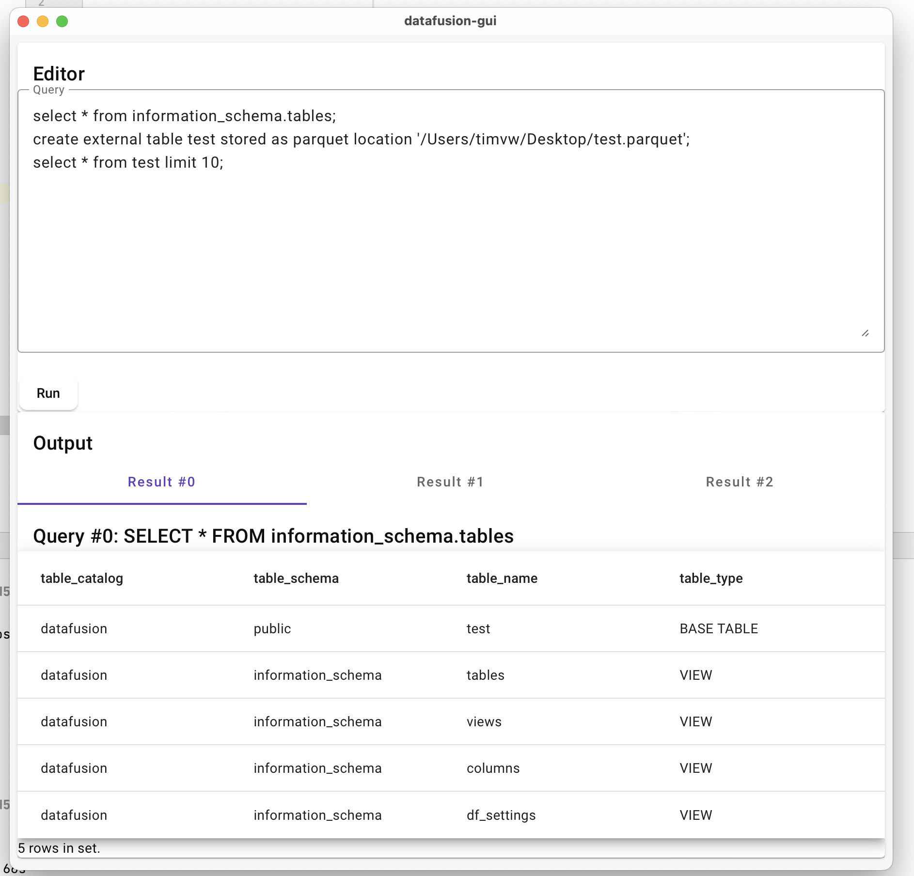

# Datafusion GUI

A GUI for [DataFusion](https://github.com/apache/arrow-datafusion).

## Installation

Simply download and run the [latest](https://github.com/timvw/datafusion-gui/releases/latest) installer for your platform.

## Demo

## Development