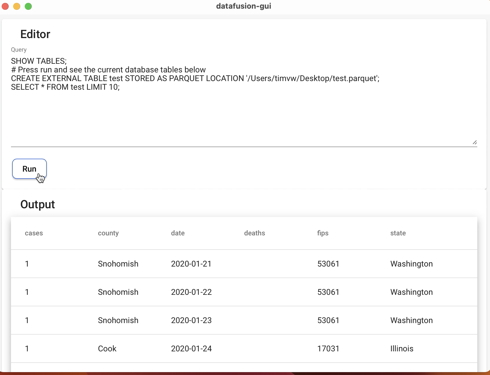

# Datafusion GUI

A simple GUI for [DataFusion](https://github.com/apache/arrow-datafusion).

## Demo

## Recommended IDE Setup

- [VS Code](https://code.visualstudio.com/) + [Tauri](https://marketplace.visualstudio.com/items?itemName=tauri-apps.tauri-vscode) + [rust-analyzer](https://marketplace.visualstudio.com/items?itemName=rust-lang.rust-analyzer) + [Angular Language Service](https://marketplace.visualstudio.com/items?itemName=Angular.ng-template)
